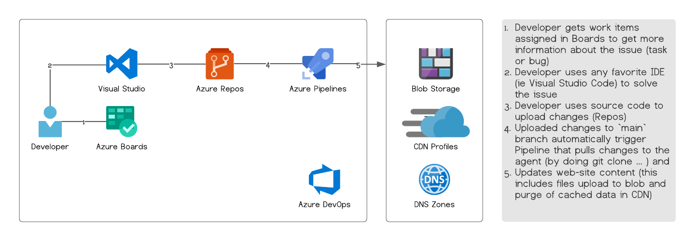

# Static Web with Azure Bicep

This repository contains *static web site sample*, *azure bicep template* with deployment script and example of *azure devops pipeline* definition.

The end goal is to set the following process: 



## Azure Bicep

[](https://portal.azure.com/#create/Microsoft.Template/uri/https%3A%2F%2Fraw.githubusercontent.com%2Fweekendsprints%2Fazure-bicep%2Fmaster%2Flab1-static-web-with-bicep%2Ftemplates%2Fmain.json)
[](http://armviz.io/#/?load=https%3A%2F%2Fraw.githubusercontent.com%2Fweekendsprints%2Fazure-bicep%2Fmaster%2Flab1-static-web-with-bicep%2Ftemplates%2Fmain.json)

Example of execution: 

```bash
az deployment sub what-if -l westeurope --template-file ./templates/main.bicep --parameters ./templates/parameters.dev.json
az deployment sub validate -l westeurope --template-file ./templates/main.bicep --parameters ./templates/parameters.dev.json
az deployment sub create -l westeurope --template-file ./templates/main.bicep --parameters ./templates/parameters.dev.json
```

In order to build ARM out of Bicep use:

```bash
 bicep build main.bicep --outdir .
 ```


